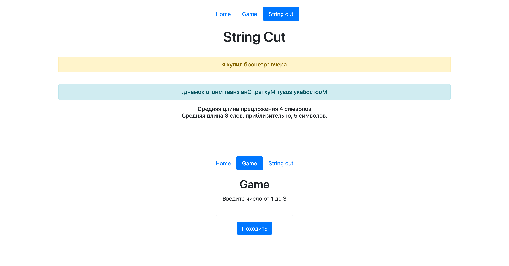
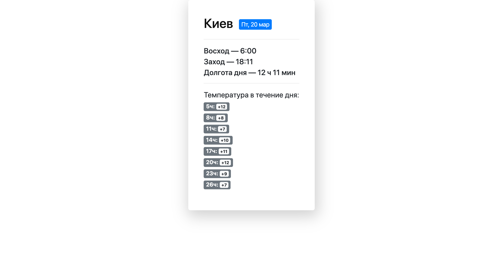
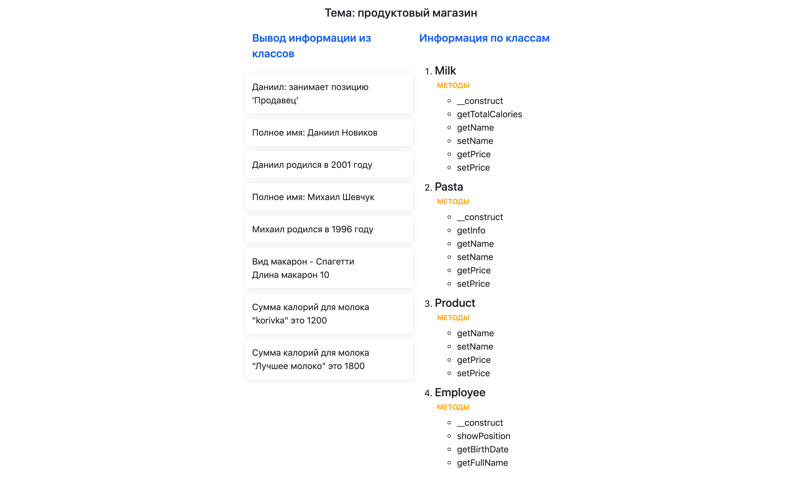
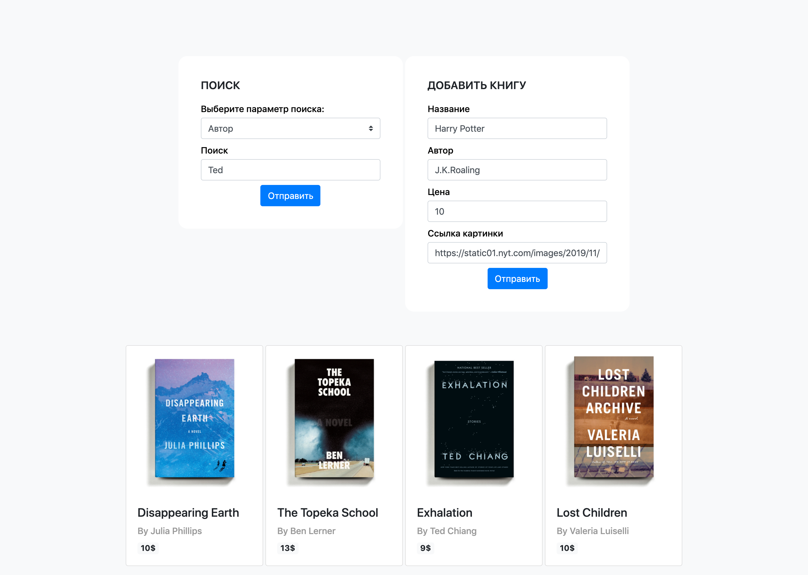

# Лабораторные и тестовые работы
###  Новиков Даниил, АИ-183

**Лабораторные работы**

1. Сдано
2. Сдано
3. [Код](https://github.com/novicode1/novicode1.github.io/tree/master/lab3) | [Демо](https://novicode1.github.io/lab3/src/index.html)
4. [Код](https://github.com/novicode1/novicode1.github.io/tree/master/lab4) | [Демо](https://novicode1.github.io/lab4/src/index.html)
5. [Код](https://github.com/novicode1/novicode1.github.io/tree/master/lab5) | [Демо](https://novicode1.github.io/lab5/src/index.html)
6. [Код](https://github.com/novicode1/novicode1.github.io/tree/master/lab6) | [Демо](https://novicode1.github.io/lab6/src/index.html)
7. [Код](https://github.com/novicode1/novicode1.github.io/tree/master/lab7) | [Демо](https://novicode1.github.io/lab7/src/index.html)
8. [Код](https://github.com/novicode1/novicode1.github.io/tree/master/lab8) | [Демо](https://novicode1.github.io/lab8/src/index.html)
9. [Код](https://github.com/novicode1/novicode1.github.io/tree/master/lab9) | [Демо](https://novicode1.github.io/lab9/src/index.html)
10. [Код](https://github.com/novicode1/novicode1.github.io/tree/master/lab10) | Гитхаб, к сожалению, не поддерживает php

11. [Код](https://github.com/novicode1/novicode1.github.io/tree/master/lab11) | Гитхаб, к сожалению, не поддерживает php

12. [Код](https://github.com/novicode1/novicode1.github.io/tree/master/lab12) | Гитхаб, к сожалению, не поддерживает php

13. [Код](https://github.com/novicode1/novicode1.github.io/tree/master/lab13) | Гитхаб, к сожалению, не поддерживает php

14. [Код](https://github.com/novicode1/novicode1.github.io/tree/master/lab14) | Гитхаб, к сожалению, не поддерживает php

***

Спасибо большое за потраченное время на проверку😃!
