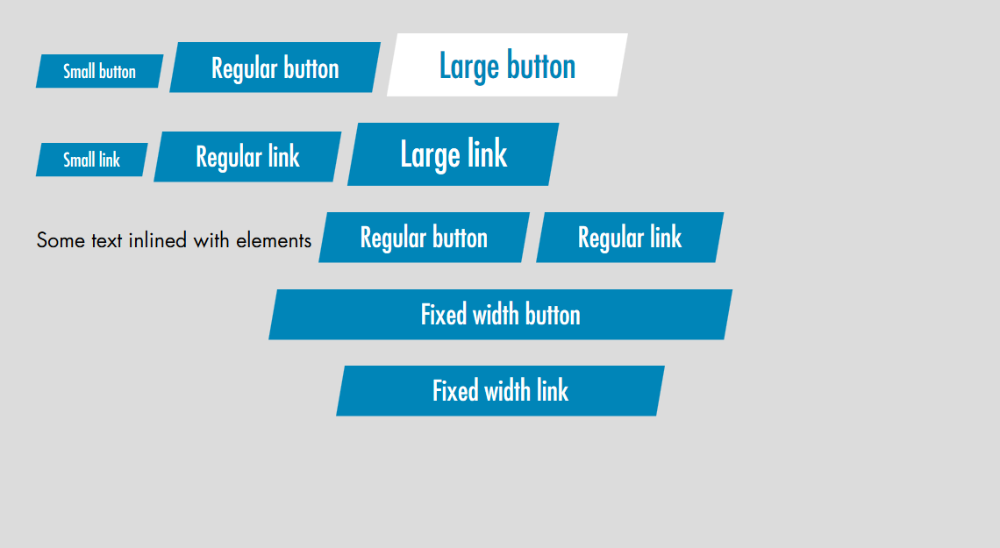

# Задание на вёрстку кнопки

Необходимо сверстать стили кнопки, которые могут использоваться как на теге `<button>`, так и на ссылке `<a class="button">`. Весь код нужно вписать в файл **src/button.css**. Всё остальное настроено.

Макет в формате Photoshop находится в папке [psd](./psd). За основу брать размеры синей кнопки

## Требования

- в разметке нельзя добавлять никакие дополнительные теги внутрь кнопки
- нельзя использовать JavaScript
- одинаковая поддержка во всех настольных браузерах кроме IE8 и ниже. Обратить внимание на вертикальное выравнивание текста
- одинаковая поддержка в мобильных браузерах: iOS Safari, Android Browser, Android Chrome, Android Firefox, IE Mobile
- ширина автоматически подстраивается под длину текста
- поддержка масштабирования шрифтов
- возможность изменения фонового цвета одним свойством
- возможность изменения цвета текста одним свойством
- возможность задать фиксированную ширину при необходимости. При этом ширина элемента должна оказаться не больше и не меньше этой величины. Края элемента - это самые дальние углы
- кнопка должна уметь показываться на любом фоне
- при выводе кнопки на строке с текстом она должна "красиво" выравниваться относительно него
- при табуляции должно быть видно как кнопки меняют фокус (прямоугольная рамка вокруг)
- при наведении на кнопку стиль фокуса должен исчезать
- только на ссылках курсор должен быть "рука"
- в дизайне нет нажатого состояния, но надо создать условия, чтобы было легко его стилизовать при необходимости
- рядом стоящие кнопки не должны заходить друг в друга
- должна быть возможность задать кнопкам любые `margin` без учёта и знаний как они реализованы внутри. При задавании `margin: 0` кнопки не должны заходить друг в друга

**Превью готовой вёрстки**

